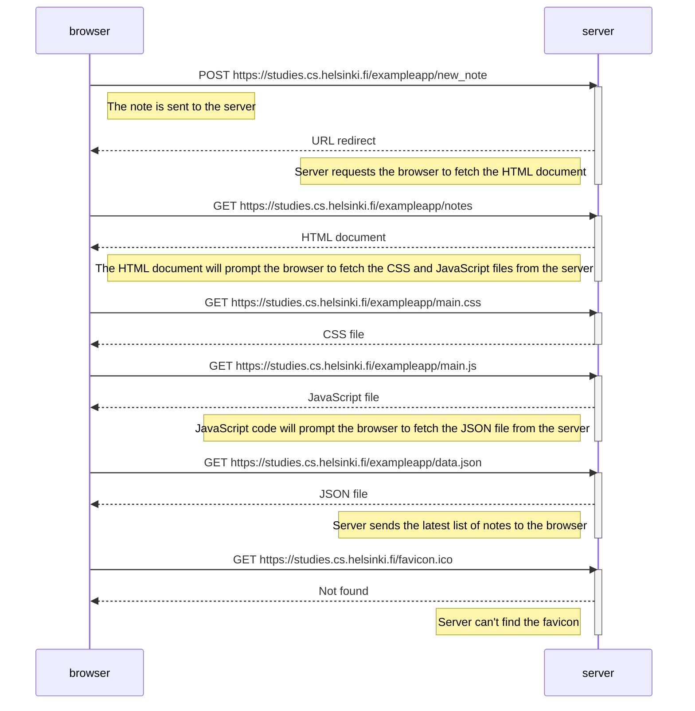

I purposefully left out all the stuff before the POST request since that was in the material already and the same stuff would get repeated twice.

```mermaid
sequenceDiagram
    participant browser
    participant server
    
    browser->>server: POST https://studies.cs.helsinki.fi/exampleapp/new_note
    activate server
    Note right of browser: The note is sent to the server
    server-->>browser: URL redirect
    Note left of server: Server requests the browser to fetch the HTML document
    deactivate server
    
    browser->>server: GET https://studies.cs.helsinki.fi/exampleapp/notes
    activate server
    server-->>browser: HTML document
    Note left of server: The HTML document will prompt the browser to fetch the CSS and JavaScript files from the server
    deactivate server
    
    browser->>server: GET https://studies.cs.helsinki.fi/exampleapp/main.css
    activate server
    server-->>browser: CSS file
    deactivate server

    browser->>server: GET https://studies.cs.helsinki.fi/exampleapp/main.js
    activate server
    server-->>browser: JavaScript file
    Note left of server: JavaScript code will prompt the browser to fetch the JSON file from the server
    deactivate server
        
    browser->>server: GET https://studies.cs.helsinki.fi/exampleapp/data.json
    activate server
    server-->>browser: JSON file
    Note left of server: Server sends the latest list of notes to the browser
    deactivate server

    browser->>server: GET https://studies.cs.helsinki.fi/favicon.ico
    activate server
    server-->>browser: Not found
    Note left of server: Server can't find the favicon
    deactivate server
```