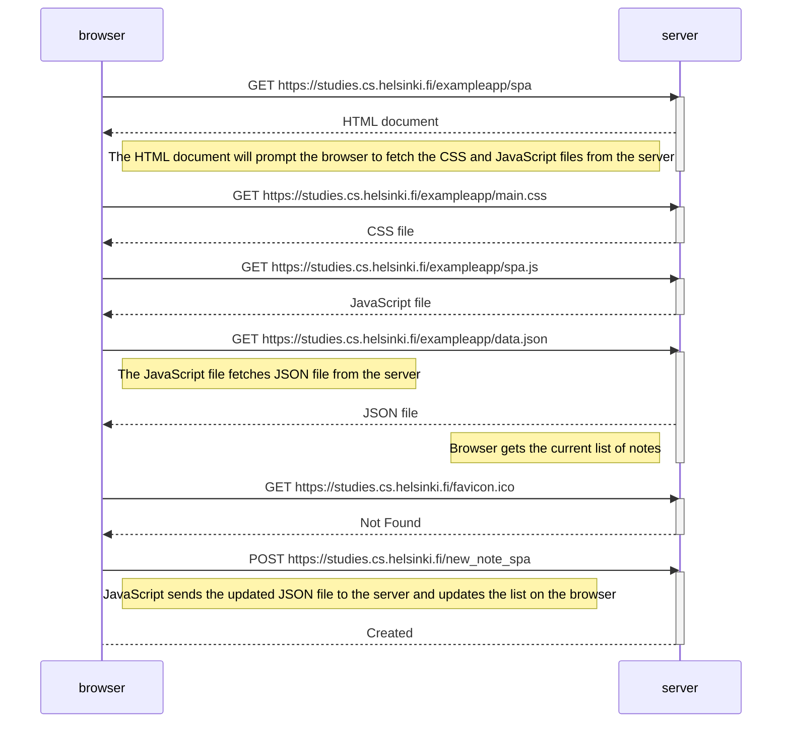

```mermaid
sequenceDiagram
    participant browser
    participant server

    browser->>server: GET https://studies.cs.helsinki.fi/exampleapp/spa
    activate server
    server-->>browser: HTML document
    Note left of server: The HTML document will prompt the browser to fetch the CSS and JavaScript files from the server
    deactivate server

    browser->>server: GET https://studies.cs.helsinki.fi/exampleapp/main.css
    activate server
    server-->>browser: CSS file
    deactivate server

    browser->>server: GET https://studies.cs.helsinki.fi/exampleapp/spa.js
    activate server
    server-->>browser: JavaScript file
    deactivate server

    browser->>server: GET https://studies.cs.helsinki.fi/exampleapp/data.json
    activate server
    Note right of browser: The JavaScript file fetches JSON file from the server 
    server-->>browser: JSON file
    Note left of server: Browser gets the current list of notes
    deactivate server

    browser->>server: GET https://studies.cs.helsinki.fi/favicon.ico
    activate server
    server-->>browser: Not Found
    deactivate server

    browser->>server: POST https://studies.cs.helsinki.fi/new_note_spa
    activate server
    Note right of browser: JavaScript sends the updated JSON file to the server and updates the list on the browser
    server-->browser: Created
    deactivate server
```